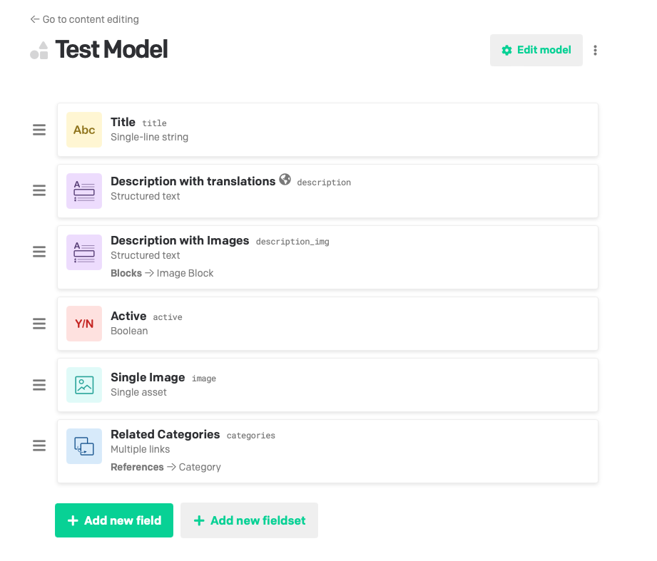
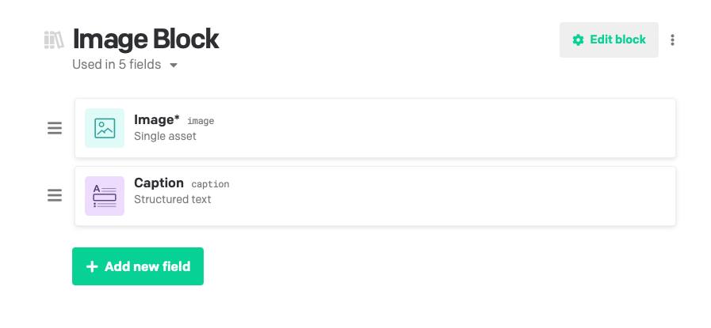

# HTML to DatoCMS Structured Text Converter

[](https://github.com/renuo/html2structured-block/actions/workflows/tests.yml)

This project provides a utility to convert HTML content into structured text format, which can be used with DatoCMS.
The converter handles various HTML elements and converts them into appropriate structured text blocks and inline elements.

## How to Run

Install the required dependencies:
```bash
npm install
```

Include the module in your project:
```javascript
const { HTML2DatoCMS } = require('./html2datocms.js');
// client is a DatoCMS client, only needed for image upload (see below)
// image_block_id is the ID of the image block in your DatoCMS project, only needed for image upload (see below)
let html2datocms = new HTML2DatoCMS(client, image_block_id);
```

Use the html2block function to convert HTML content to structured text:
```javascript
const html = '<p>Example HTML content</p>';
const structured_text = await html2datocms.html2block(html);
```

### Advanced Usage

The `html2datocms.js` module provides a number of functions that can be used to convert HTML content to structured text, upload images to DatoCMS, and fetch records from DatoCMS.

The following functions are available:

**html2block**

Converts HTML content to structured text.

```javascript
const html = '<p>Hello, world!</p>';
html2datocms.html2block(html)
    .then(structured_text => {
        console.log(structured_text);
    })
    .catch(error => {
        console.error(error);
    });
```

**boolToDatoCMS**

Converts a boolean value (loaded from a JSON or CSV file) to a boolean value.

```javascript
const boolValue = "true";
const datoCMSBoolValue = html2datocms.boolToDatoCMS(boolValue);
console.log('DatoCMS boolean value:', datoCMSBoolValue);
```

**fetchRecords**

Fetches records from DatoCMS. Can be used to check if a record already exists before creating a new one or to fetch related records. See the [example.js](example/example.js) file for a complete example.

```javascript
const itemType = 'YOUR_ITEM_TYPE';
const field = 'YOUR_FIELD';
const value = 'YOUR_VALUE';

html2datocms.fetchRecords(itemType, field, value)
    .then(records => {
        console.log(records);
    })
    .catch(error => {
        console.error(error);
    });
```

**uploadToDatoCMS**

Uploads an image to DatoCMS. Also used by the `html2block` function to upload images referenced in `` tags. See the [example.js](example/example.js) file for a complete example.

```javascript
const imageUrl = 'https://example.com/image.jpg';

html2datocms.uploadToDatoCMS(imageUrl)
    .then(upload => {
        console.log(upload);
    })
    .catch(error => {
        console.error(error);
    });
```

### Complete Example

Check out the [example.js](example/example.js) file for a complete example of how to use the converter.

The model we used on DatoCMS is the following:
<center>
    
    
</center>

## How to Test

Run the test suite:
```bash
npm test
```

This will run the tests defined in the `html2datocms.test.js` file.

## DatoCMS

**Setting up the Client**

Install the DatoCMS client package:
```bash
npm install @datocms/cma-client-node
```

Import the `buildClient` function from the DatoCMS client package:
```javascript
const buildClient = require('@datocms/cma-client-node').buildClient;
```

Create the DatoCMS client using your API token:

```javascript
const client = buildClient({ apiToken: 'YOUR_API_TOKEN' });
```

Replace `YOUR_API_TOKEN` with your actual DatoCMS API token.

Now you can use the DatoCMS client with the functions provided in the `html2datocms.js` module, such as `uploadToDatoCMS` and `fetchRecords`.


### Custom Tags

**IMG-Tags/Image Block**

For ``-Tags, you need to add a custom Block to DatoCMS.

You will need to fetch the appropriate image block ID from your own DatoCMS account.
To obtain the correct image block ID, navigate to your DatoCMS project's settings.

Go to:
- Blocks Library
- Create a Block called for example `Image Block`
- Copy the `Model ID`

```javascript
result = await html2block(html, client, model_id);
```

### Handling Unknown HTML Tags

This project is designed to handle a variety of common HTML tags and convert them into structured text.
However, there may be cases where the code encounters an unknown or unsupported HTML tag.
In such scenarios, the code has a specific mechanism to manage these unknown tags.

When the code identifies an unknown HTML tag, it generates an error block containing a message about the encountered issue.
This error block takes the form of a paragraph with a strong emphasis style.
The message will include `!!!!!!!! Error !!!!!!!!` followed by a brief description of the problem, such as `Unknown node: ` and the name of the unknown tag.

By generating an error block for each unknown tag, the code provides a clear indication of any issues encountered during the conversion process. This allows you to review the output in DatoCMS and identify any problematic tags that require manual intervention or adjustments to the code for proper handling.

If you need to extend the support for additional HTML tags, you can modify the code in the `buildTree` function accordingly, by adding new conditions or adjusting the existing ones to manage the new tags as needed.

See [html2datocms.js](html2datocms.js) for more details.
